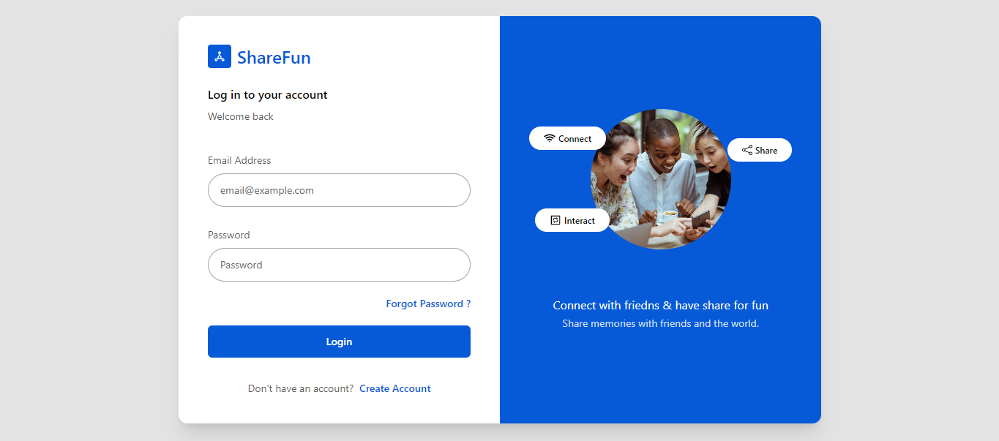
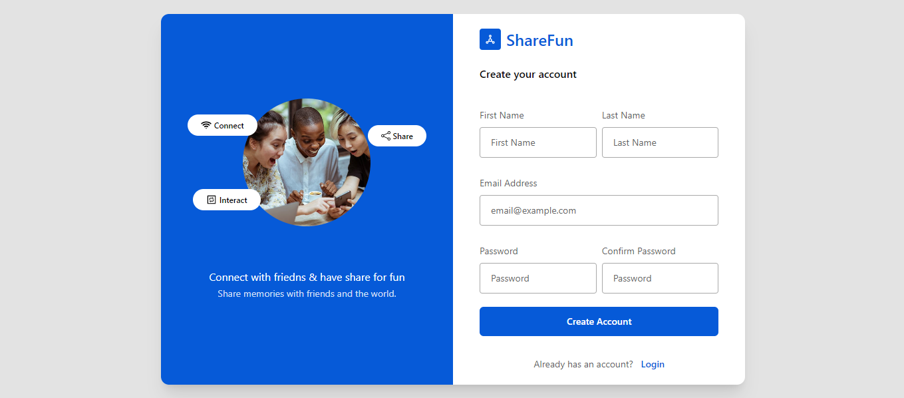
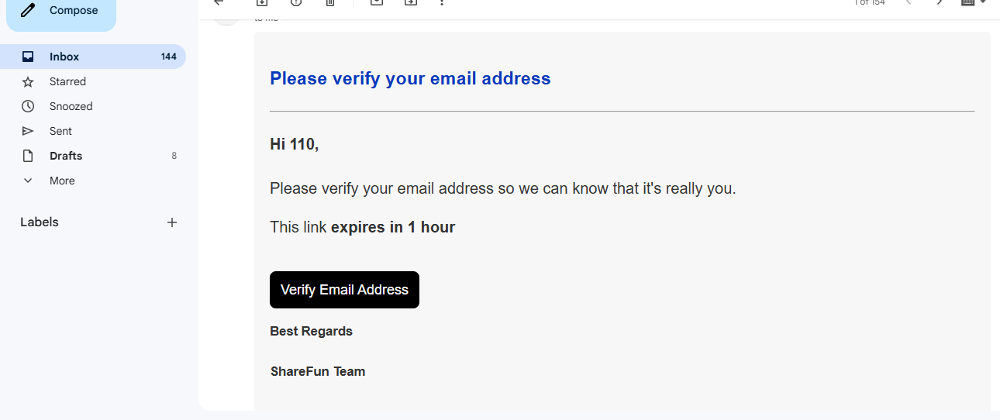
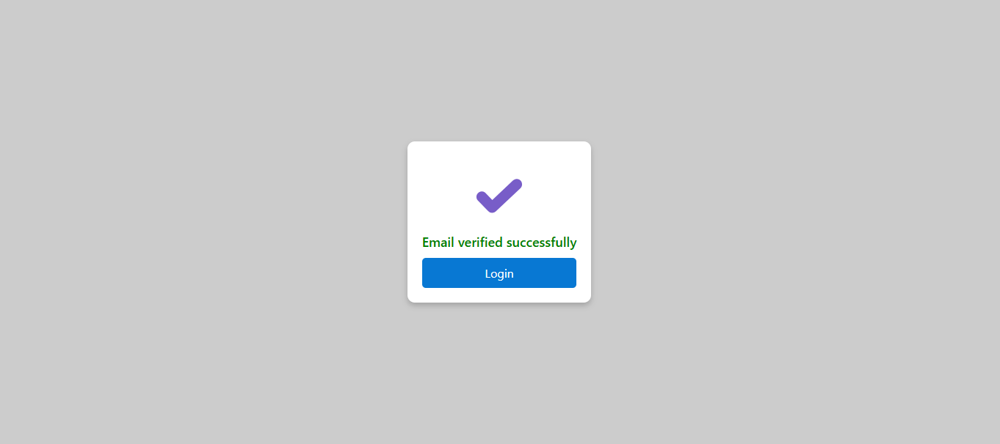
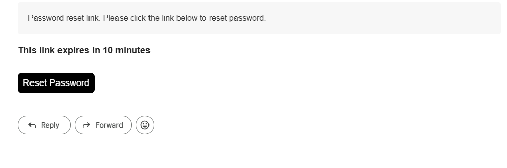
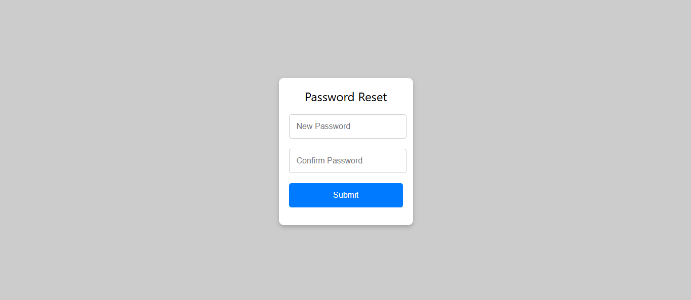
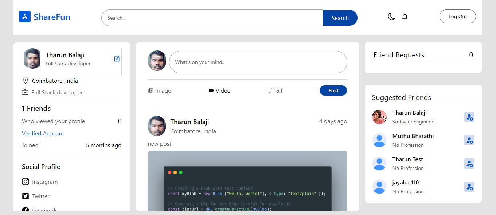
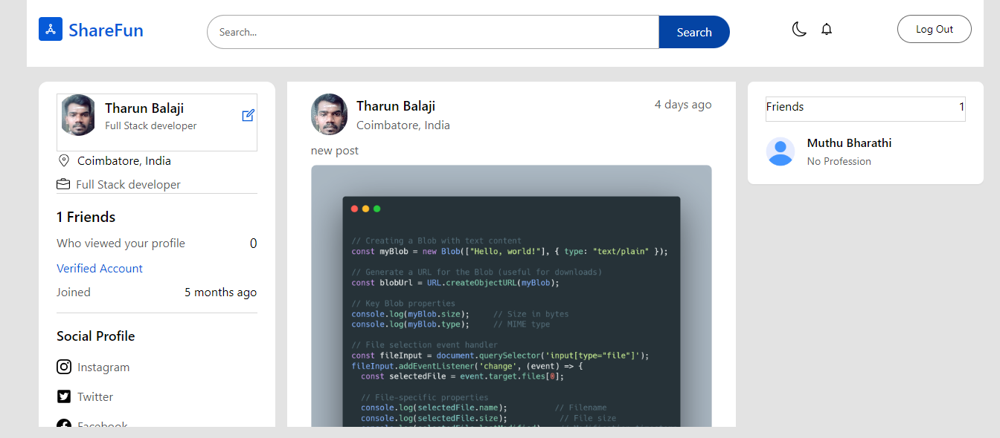
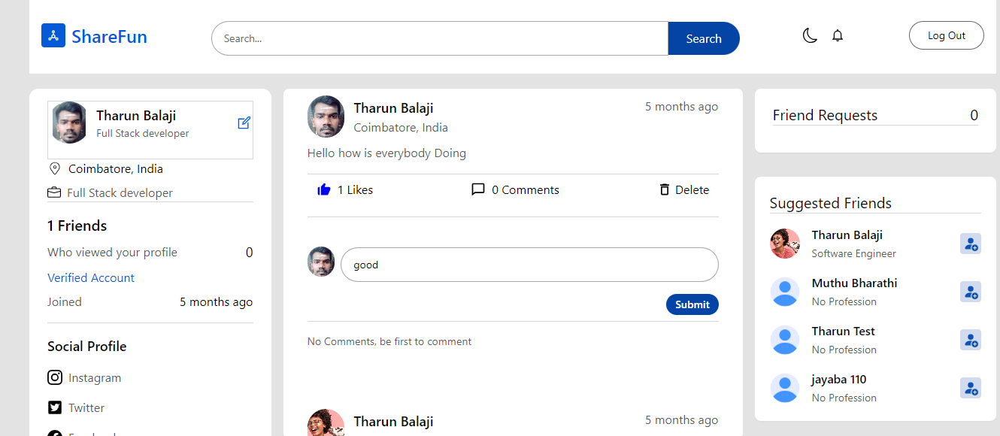

# ShareFun: Full-Stack Social Media Application

## 🌟 Project Overview

ShareFun is a comprehensive full-stack social media application designed to provide users with a rich, interactive social networking experience. Built using modern web development technologies, the application offers a robust platform for content sharing, social interactions, and personal connectivity.

## 📋 Table of Contents
- [Project Overview](#-project-overview)
- [Technologies](#-technologies)
- [Features](#-features)
- [Preview](#-preview)
- [Project Structure](#-project-structure)
- [State Management](#-state-management)
- [Backend Architecture](#-backend-architecture)
- [Authentication Flow](#-authentication-flow)
- [Getting Started](#-getting-started)
- [Detailed Component Breakdown](#-detailed-component-breakdown)

## 🛠 Technologies

### Frontend
- **React.js**: Core UI library
- **Redux**: State management
- **React Router**: Navigation
- **Tailwind CSS**: Responsive styling
- **Axios**: HTTP requests

### Backend
- **Node.js**: Runtime environment
- **Express.js**: Web application framework
- **MongoDB**: Database
- **Mongoose**: ODM (Object Document Mapper)
- **JSON Web Token (JWT)**: Authentication

### Additional Tools
- **Cloudinary**: Media storage and management
- **Nodemailer**: Email services
- **UUID**: Unique identifier generation
- **Helmet**: Enhanced security middleware

## ✨ Features

### 1. User Authentication System
- Secure user registration
- Email verification process
- Password reset functionality
- JWT-based authentication

### 2. Social Interactions
- Send and manage friend requests
- View suggested friends
- Profile view tracking

### 3. Content Management
- Create, edit, and delete posts
- Support for multimedia content (images, GIFs, videos)
- Commenting and replying system
- Like posts and comments

### 4. User Experience
- Responsive design
- Light/Dark theme toggle
- Profile customization


## 🖼️ Preview

### Login Page


### Signup Page


### Verification mail


### Email verification


### Password reset Mail


### Password reset Page


### Home Page


### Profile Page


### commenting on post


## 📂 Project Structure

```
social-media-app/
│
├── client/                 # React Frontend
│   ├── src/
│   │   ├── redux/          # State management
│   │   │   ├── userSlice.js
│   │   │   ├── postSlice.js
│   │   │   ├── themeSlice.js
│   │   │   └── store.js
│   │   ├── components/
│   │   └── pages/
│
└── server/
    ├── controllers/        # Business logic
    │   ├── authController.js
    │   ├── postController.js
    │   └── userController.js
    ├── models/             # Database schemas
    ├── routes/             # API routes
    ├── middlewares/        # Request processing
    └── utils/              # Utility functions
```

## 🔄 State Management (Redux)

### User Slice
```javascript
import { createSlice } from "@reduxjs/toolkit";

const userSlice = createSlice({
  name: "user",
  initialState: {
    user: JSON.parse(window?.localStorage.getItem("user")) ?? {},
    edit: false
  },
  reducers: {
    login: (state, action) => { 
      state.user = action.payload;
      localStorage.setItem("user", JSON.stringify(action.payload));
    },
    logout: (state) => {
      state.user = null;
      localStorage.removeItem("user");
    },
    updateProfile: (state, action) => {
      state.edit = action.payload;
    },
  },
});

// Action creators
export function UserLogin(user) {
  return (dispatch) => { 
    dispatch(userSlice.actions.login(user))
  }
}

export function Logout() {
  return (dispatch) => { 
    dispatch(userSlice.actions.logout())
  }
}
```

### Theme Slice
```javascript
import { createSlice } from "@reduxjs/toolkit";

const themeSlice = createSlice({
  name: "theme",
  initialState: {
    theme: JSON.parse(window?.localStorage.getItem("theme")) ?? "light",
  },
  reducers: {
    setTheme: (state, action) => {
      state.theme = action.payload;
      localStorage.setItem("theme", JSON.stringify(action.payload));
    },
  },
});

// Theme toggle action creator
export function SetTheme(value) {
  return (dispatch) => { 
    dispatch(themeSlice.actions.setTheme(value))
  }
}
```

## 🔒 Authentication Middleware
```javascript
import JWT from "jsonwebtoken";

const userAuth = async (req, res, next) => {
  const authHeader = req?.headers?.authorization;

  if (!authHeader || !authHeader?.startsWith("Bearer")) {
    next("Authentication failed");
  }

  const token = authHeader?.split(" ")[1];

  try {
    const userToken = JWT.verify(token, process.env.JWT_SECRET_KEY);

    req.body.user = {
      userId: userToken.userId,
    };

    next();
  } catch (error) {
    next("Authentication failed");
  }
};
```

## 📧 Email Verification Service
```javascript
export const sendVerificationEmail = async (user, res) => {
  const { _id, lastName, email } = user;
  const token = _id + uuidv4();
  const link = APP_URL + "users/verify/" + _id + "/" + token;

  const mailOptions = {
    from: AUTH_EMAIL,
    to: email,
    subject: "Email Verification",
    html: `<div style='font-family: Arial, sans-serif;'>
      <h3>Please verify your email address</h3>
      <p>Hi ${lastName}, Please verify your email</p>
      <a href=${link}>Verify Email Address</a>
    </div>`,
  };

  try {
    const hashedToken = await hashString(token);
    const newVerifiedEmail = await Verification.create({
      userId: _id,
      token: hashedToken,
      createdAt: Date.now(),
      expiresAt: Date.now() + 3600000, // 1 hour
    });

    if (newVerifiedEmail) {
      transporter.sendMail(mailOptions)
        .then(() => {
          res.status(201).send({
            success: "PENDING",
            message: "Verification email sent",
          });
        });
    }
  } catch (error) {
    res.status(404).json({ message: "Something went wrong" });
  }
};
```

## 🗄 Database Models

### User Model
```javascript
const userSchema = new mongoose.Schema({
  firstName: {
    type: String,
    required: [true, "First Name is Required!"],
  },
  lastName: {
    type: String,
    required: [true, "Last Name is Required!"],
  },
  email: {
    type: String,
    required: [true, "Email is Required!"],
    unique: true,
  },
  password: {
    type: String,
    required: [true, "Password is Required!"],
    minlength: [6, "Password should be >6 characters"],
  },
  profileUrl: { type: String },
  friends: [{ type: Schema.Types.ObjectId, ref: "Users" }],
  verified: { type: Boolean, default: false },
}, { timestamps: true });
```

### Post Model
```javascript
const postSchema = new mongoose.Schema({
  userId: { type: Schema.Types.ObjectId, ref: "Users" },
  description: { type: String, required: true },
  image: { type: String },
  likes: [{ type: String }],
  comments: [{ type: Schema.Types.ObjectId, ref: "Comments" }],
}, { timestamps: true });
```

## 🚀 Getting Started

### Prerequisites
- Node.js (v14+)
- MongoDB Atlas account
- Cloudinary account
- Gmail account for email services

### Installation Steps
1. Clone the repository
2. Install dependencies
   ```bash
   # Backend setup
   cd server
   npm install

   # Frontend setup
   cd client
   npm install
   ```
3. Create `.env` files with:
   - MongoDB connection string
   - JWT secret
   - Cloudinary credentials
   - Email service credentials

4. Run the application
   ```bash
   # Start backend (from server directory)
   npm run dev

   # Start frontend (from client directory)
   npm start
   ```

## 🔗 Project Links
- **Live Demo**: [ShareFun Social Media App](https://social-media-app-ksvc.onrender.com/)
- **GitHub Repository**: [Full Stack Project](https://github.com/Tharun-Balaji/Full-Stack/tree/main/Full_Stack_project/socialpedia)

## 🚧 Future Enhancements
- Real-time messaging
- Advanced search functionality
- Enhanced privacy controls
- Two-factor authentication
- Comprehensive analytics dashboard

## 🤝 Contributing
1. Fork the repository
2. Create your feature branch
3. Commit your changes
4. Push to the branch
5. Create a Pull Request

## 📄 License
[MIT License](https://opensource.org/licenses/MIT)

## 📧 Contact
For any queries, please reach out to [Tharun Balaji](mailto:tharunbalaji110.com).